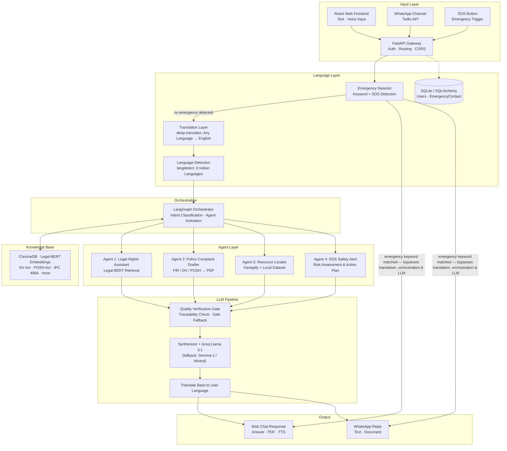

# SakhiBot 🛡️
### Women's Legal Rights & Emergency Response AI

**An agentic, multilingual AI platform for women's legal empowerment and safety in India.**

SakhiBot combines a citation-grounded legal assistant, an automated document drafter, a location-based resource locator, and a keyword-triggered emergency response layer into a single conversational platform — accessible via a web chat interface, with WhatsApp integration for wider reach.

> Final Year B.Tech Project — Department of Computer Science & Engineering (Data Science), Meghnad Saha Institute of Technology, affiliated to MAKAUT, West Bengal (Session 2025–26)

---

## Table of Contents

- [The Problem](#the-problem)
- [Proposed Solution](#proposed-solution)
- [System Architecture](#system-architecture)
- [The Four Agents](#the-four-agents)
- [Knowledge Base](#knowledge-base)
- [Tech Stack](#tech-stack)
- [Database Design & Privacy](#database-design--privacy)
- [Use Cases](#use-cases)
- [Performance](#performance)
- [What Sets SakhiBot Apart](#what-sets-sakhibot-apart)
- [Getting Started](#getting-started)
- [Environment Variables](#environment-variables)
- [Future Scope](#future-scope)
- [Team](#team)
- [License](#license)

---

## The Problem

Women's safety and access to legal justice are guaranteed by the Constitution of India and reinforced by the **Protection of Women from Domestic Violence Act (2005)**, the **POSH Act (2013)**, and provisions of the **IPC** — yet during an actual emergency, this protection is often out of reach:

| # | Limitation |
|---|---|
| 1 | **Lack of Legal Awareness** — women are often unaware of their rights, applicable laws, and complaint procedures |
| 2 | **Scattered Information** — legal information is spread across government portals, PDFs, and websites |
| 3 | **Generic, Hallucinating Chatbots** — general-purpose AI chatbots give unverified answers with no legal citation |
| 4 | **Language Barrier** — legal resources are mostly English-only, excluding regional-language speakers |
| 5 | **No Document Generation** — existing systems rarely help draft FIRs or complaint letters automatically |
| 6 | **Fragmented Emergency Support** — safety apps give SOS alerts only, with no legal guidance or resource discovery |

## Proposed Solution

SakhiBot unifies legal guidance, document drafting, resource discovery, and emergency response into one platform, built around four principles:

- **Citation-grounded, not generic** — every legal answer is retrieved from actual statute text, never generated from unverified model memory
- **Multilingual by default** — 9 Indian languages, so language is never the barrier between a woman and her rights
- **Emergency-first** — the SOS path bypasses the AI pipeline entirely, so a critical response is never delayed by model latency
- **Privacy-aware** — legal drafts are generated on-the-fly and never persisted to a database

## System Architecture



The architecture follows a modular multi-tier design: input channels converge on a single FastAPI gateway, then hit the Emergency Detector first. If a danger keyword or the SOS button fires, the request **bypasses translation, orchestration, and the LLM pipeline entirely** and returns helpline numbers directly — this is what gives SOS its 120–200 ms response time. Otherwise, the query is translated, routed by a LangGraph orchestrator to one or more of four specialized agents, and every legally significant output passes a quality verification gate before being synthesized, translated back, and delivered.

## The Four Agents

### ⚖️ Agent 1 — Legal Rights Assistant
Retrieves statutes via **Legal-BERT** (`nlpaueb/legal-bert-base-uncased`) embeddings stored in ChromaDB, with keyword-based routing to the correct Act. The Groq-hosted LLM answers **strictly from retrieved context**, citing the relevant section — or returns a `NOT_FOUND_IN_KB` sentinel rather than guessing, which the system converts into a safe, helpline-directed fallback message.

### 📄 Agent 2 — Police Complaint Drafter
A slot-filling conversational loop collects each required field for an FIR, DV Act application, or POSH complaint turn-by-turn, then compiles a ready-to-print, formatted PDF via ReportLab — without ever persisting the draft to the database.

### 📍 Agent 3 — Resource Locator
Fuzzy-matches (`difflib`) the user's city/state against a curated local JSON dataset of One Stop Centres, shelters, and legal aid clinics, backed by the **Geoapify Places API** for live lookups, with results sorted by Haversine distance and automatic failover between the two sources.

### 🆘 Agent 4 — SOS Safety Alert Agent
Assesses situational risk (danger level, presence of children, escape options) and outputs a numbered, personalized action plan — immediate safety steps, key documents to carry, the nearest OSC, and relevant applicable laws.

> **Note:** In addition to Agent 4's conversational safety planning, SakhiBot has a separate, faster **Emergency Detection Layer** that fires on explicit danger keywords and bypasses the entire agent pipeline to return national helpline numbers (181 / 100 / 112) in as little as 120 ms — because a genuine emergency should never wait on model inference.

## Knowledge Base

The legal knowledge base is built from curated Bare Acts — the **Domestic Violence Act (2005)**, **POSH Act (2013)**, **IPC Section 498A**, the **Dowry Prohibition Act**, and others — extracted and chunked via **PyMuPDF**, embedded with Legal-BERT, and stored in **ChromaDB**. Keyword-based query routing narrows retrieval to the correct Act before semantic search runs, and the LLM is never allowed to answer outside the retrieved context.

## Tech Stack

| Layer | Technology |
|---|---|
| **Frontend** | React 19 · Vite · Tailwind CSS |
| **Backend** | FastAPI · Uvicorn · SQLAlchemy ORM |
| **AI Orchestration** | LangGraph · Groq API (Llama 3.1-8B Instant, with fallback to Gemma 2 / Mixtral on rate limits) |
| **Retrieval** | ChromaDB · Legal-BERT (`nlpaueb/legal-bert-base-uncased`) |
| **Knowledge Ingestion** | PyMuPDF (`fitz`) — text extraction & chunking |
| **Documents** | ReportLab (PDF generation) · python-docx (templates) |
| **Location Services** | Geoapify Places API · `difflib` fuzzy matching · Haversine distance sorting |
| **Language** | deep-translator · langdetect (9 Indian languages) |
| **Data & Auth** | SQLite · passlib + bcrypt · JWT (HS256) |
| **Messaging** | Twilio API — WhatsApp Business integration |

## Database Design & Privacy

The schema is deliberately minimal, by design:

- **Users** — account and profile information
- **EmergencyContact** — one User → many EmergencyContact rows (via foreign key)
- **Authentication** — JWT (HS256) with bcrypt-hashed passwords

**No Persistent Drafts:** legal documents (FIR / DV / POSH complaints) are compiled on-the-fly as transient in-memory PDF byte streams and are **never written to the database**. Logging out instantly wipes any trace of in-memory draft data — a deliberate privacy-first decision given the sensitivity of the content users share.

## Use Cases

| Query | Result |
|---|---|
| *"What is Section 498A?"* | Legal Retriever returns a cited, plain-language explanation grounded in the actual IPC text |
| *"Draft an FIR for domestic violence."* | Document Drafter collects details conversationally, then generates a print-ready PDF |
| *"Find nearby shelter homes."* | Resource Locator returns nearby OSCs, shelters & legal aid with distances and helplines |
| *"Help! Someone is attacking me."* | Emergency layer bypasses all agents and instantly returns helpline numbers (181, 100, 112) with an SOS banner |

## Performance

| Test Case | Activated Module | Response Time |
|---|---|---|
| Legal Information | Legal Retrieval Agent | 1200–1500 ms |
| Document Drafting | Document Drafting Agent | 1500–1800 ms |
| **Emergency SOS** | Emergency Detection Layer (agents bypassed) | **120–200 ms** |
| Resource Search | Resource Locator | 350–380 ms |
| Multilingual Query | Translation + Legal Agent | 2200–2800 ms |

## What Sets SakhiBot Apart

- **Citation-Grounded, Not Generic** — Legal-BERT RAG with a strict grounding rule (`NOT_FOUND_IN_KB`) eliminates hallucination, unlike general-purpose AI chatbots
- **Modular Multi-Agent Design** — LangGraph coordinates 4 specialized agents; scalable, maintainable, extensible
- **True Multilingual Reach** — 9 Indian languages remove the barrier most legal-AI tools never solve
- **Dual-Source Resource Lookup** — Geoapify Places API + a curated local dataset, Haversine-sorted, with automatic failover
- **Privacy-Aware by Design** — JWT authentication, bcrypt-hashed passwords, and drafted complaints that are never persisted
- **Real-Time Emergency Response** — SOS bypasses the AI pipeline entirely; helpline numbers return in as little as 120 ms

## Getting Started

### Prerequisites
- Python 3.12
- Node.js 18+
- A [Groq API key](https://console.groq.com)
- A [Twilio account](https://console.twilio.com) (for WhatsApp integration)
- A [Geoapify API key](https://www.geoapify.com) (for resource lookup)

### Backend Setup
```bash
cd backend
python -m venv venv
venv\Scripts\activate        # Windows
# source venv/bin/activate   # macOS/Linux

pip install -r requirements.txt
cp .env.example .env         # then fill in the values below

python scripts/ingest.py     # builds the ChromaDB knowledge base
uvicorn main:app --reload
```

### Frontend Setup
```bash
cd frontend
npm install
npm run dev
```

### WhatsApp Integration (local development)
```bash
ngrok http 8000
```
Then set the resulting `https://*.ngrok-free.app/api/whatsapp/webhook` URL as your WhatsApp Sandbox's "when a message comes in" webhook in the Twilio Console.

## Environment Variables

Create a `backend/.env` file with:

```env
GROQ_API_KEY=your_groq_api_key
JWT_SECRET_KEY=your_jwt_secret
JWT_ALGORITHM=HS256
ACCESS_TOKEN_EXPIRE_MINUTES=60

TWILIO_ACCOUNT_SID=your_twilio_sid
TWILIO_AUTH_TOKEN=your_twilio_auth_token

GEOAPIFY_API_KEY=your_geoapify_api_key
```

## Future Scope

SakhiBot's current scope is deliberately focused; several enhancements are planned or under active consideration:

**Emergency Response**
- **Admin Control Room** — a secure administrative interface to monitor and route live SOS alerts
- **Automated Alerts to Authorities** — forwarding verified SOS alerts, with the user's real-time location and profile, directly to the nearest police station and One Stop Centre — without requiring the victim to make a phone call
- **Google Places API Integration** — supplementing/replacing the current Geoapify lookup with Google Places for broader, more current coverage of nearby police stations, OSCs, and legal aid offices

**Evidence & Hardware**
- **Audio Evidence Recording** — consent-based background microphone capture during an active SOS event, analyzing scream detection, volume thresholds, and threat phrases
- **Video/Camera Distress Analysis** — live camera feed analysis for visual threat cues (e.g., a visible weapon) to trigger escalated dispatch
- **Tamper-Proof Evidence Storage** — recorded audio/video stored securely and transmitted for FIR documentation or legal proceedings, with clear chain-of-custody handling
- **Hardware SOS Trigger** — a physical panic-button device or wearable (e.g., Bluetooth-paired) to activate SOS without needing to unlock or open the phone

**Trust & Safety**
- **Misuse Mitigation Safeguards** — since SakhiBot only ever produces a *draft* document (never an auto-filed legal complaint), future work includes consistency checks, duplicate/rate-limit detection for repeated complaints against the same individual, and a mandatory human/legal review checkpoint before submission. To be clear: SakhiBot does not and should not attempt to judge the truth of any allegation — that determination belongs to the police and courts. These safeguards are about strengthening the review process around drafting, not about the AI adjudicating credibility.

**Knowledge Base & Reach**
- **Broader Knowledge Base via Web Scraping** — automated ingestion from sources like the India Code portal to keep statutory text current without manual PDF collection, alongside structured case-law datasets for court-interpretation context
- **Native Mobile App** — a dedicated Android/iOS app (React Native or Flutter) alongside the current web and WhatsApp channels, for offline-friendlier access and push-notification-based alerts
- **Emotional Well-being Awareness** — gentle, non-diagnostic pattern-flagging in conversation to nudge users showing signs of distress toward professional support, without labeling or diagnosing their mental state
- **Retrieval at Scale** — reranking and semantic query caching to stay fast as the knowledge base and traffic grow

## Team

| Name | Roll No. |
|---|---|
| Srijon Sen | 14230522019 |
| Avirup Dasgupta | 14230522002 |
| Smriti Mahato | 14230522025 |
| Rivhu Shil | 14230822062 |
| Srimoy Bhattacharya | 14231722001 |

**Guide:** Ms. Chandreyee Chakroborty, Assistant Professor, Dept. of CSE (Data Science)

Department of Computer Science & Engineering, **Meghnad Saha Institute of Technology**, affiliated to MAKAUT, West Bengal — Session 2025–26

## License

This project was developed as a final year academic project. Please open an issue or contact the team before reuse in another context.

---

<p align="center">If you or someone you know needs immediate help, call <b>181</b> (Women's Helpline), <b>100</b> (Police), or <b>112</b> (National Emergency Number).</p>